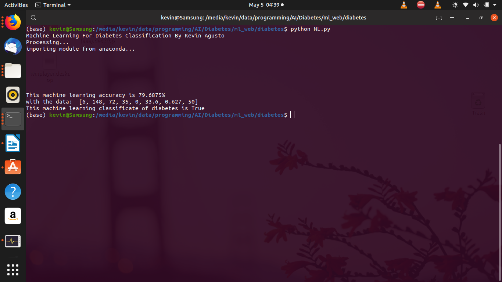
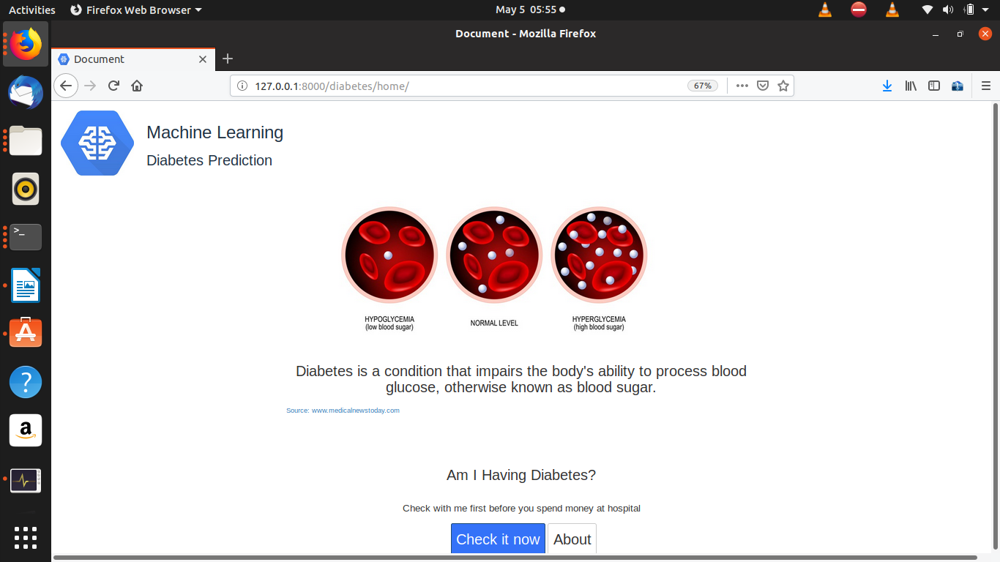
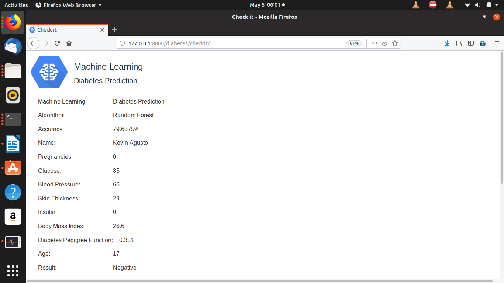

SS
<h1>Tested on: </h1>
<h4>OS Ubuntu 19.04</h4>
<h4>Python 3.7.3</h4>
<h4>GCC 8.3.0</h4>
<h4>Anaconda 4.6.14</h4>
<h4>Django 2.2.1</h4>

<h1>Install C++ module</h1>
<h3>python setup.py install</h3>

<h2>Machine Learning Core: ml_web/diabetes/ML.py</h2>

<h1>Run</h1>
<h3>python Diabetes/ml_web/manage.py runserver</h3>

<h2>Output (Try it to get another output) :v</h2>

